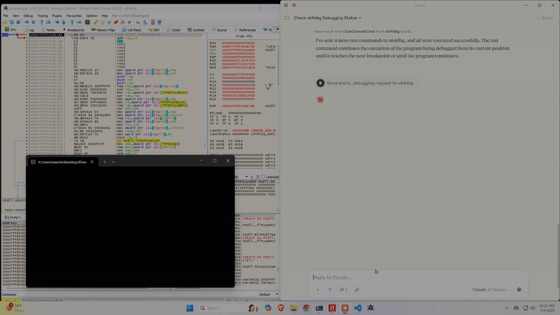

# x64dbgmcp

**Model Context Protocol for x64dbg**

A comprehensive MCP server that can bridge various LLMS with the x64dbg debugger, providing direct access to debugging functionality through natural language.

### **40+ x64dbg SDK Tools** - Complete access to debugging, memory manipulation, and code analysis

## Available Functions

### Core Debug Control
- `ExecCommand` - Execute any x64dbg command
- `IsDebugActive` - Check debugger status
- `IsDebugging` - Check if debugging a process

### Register Operations
- `RegisterGet` / `RegisterSet` - Read/write CPU registers

### Memory Management
- `MemoryRead` / `MemoryWrite` - Read/write process memory
- `MemoryIsValidPtr` - Validate memory addresses
- `MemoryGetProtect` - Get memory protection flags
- `MemoryBase` - Find module base addresses

### Debug Control
- `DebugRun` / `DebugPause` / `DebugStop` - Control execution
- `DebugStepIn` / `DebugStepOver` / `DebugStepOut` - Step through code
- `DebugSetBreakpoint` / `DebugDeleteBreakpoint` - Manage breakpoints

### Assembly & Disassembly
- `AssemblerAssemble` / `AssemblerAssembleMem` - Assemble instructions
- `DisasmGetInstruction` / `DisasmGetInstructionRange` - Disassemble code
- `DisasmGetInstructionAtRIP` - Get current instruction
- `StepInWithDisasm` - Step and disassemble

### Stack Operations
- `StackPop` / `StackPush` / `StackPeek` - Stack manipulation

### CPU Flags
- `FlagGet` / `FlagSet` - Read/write CPU flags (ZF, CF, etc.)

### Pattern Matching
- `PatternFindMem` - Find byte patterns in memory

### Utilities
- `MiscParseExpression` - Parse x64dbg expressions
- `MiscRemoteGetProcAddress` - Get API addresses
- `GetModuleList` - List loaded modules


### Quick Setup

1. **x64dbg Configuration**
   - You only need two files from this repo to get started, the Python file in the src directory, and the .dp64 file from the build\release directory 
   - Grab .dp64 from this repo's build/release directory
   - Copy to your local: [x64dbg_dir]/release/x64/plugins/

3. **Configure Claude Desktop**
   -  x64dbgmcp.py from this repos src directory
   - Update local claude_desktop_config.json with path to x64dbgmcp.py

```json
{
  "mcpServers": {
    "x64dbg": {
      "command": "Path\\To\\Python",
      "args": [
        "Path\\to\\x64dbg.py"
      ]
    }
  }
}
```
      
4. **Start Debugging**
   - Launch x64dbg
   - Start Claude Desktop
   - Check plugin loaded successfully (ALT+L in x64dbg for logs)

### Build from Source


- git clone [repository-url]
- cd x64dbgmcp/build
- cmake .. -DBUILD_X64=ON (x86 NOT SUPPORTED due to time constraints, types would need modified, registers need adjusted, etc...)
- cmake --build . --config Release


## Usage Examples

**Set a breakpoint and analyze:**
```
"Set a breakpoint at the main function and step through the first few instructions"
```

**Memory analysis:**
```
"Read 100 bytes from address 0x401000 and show me what's there"
```

**Register inspection:**
```
"What's the current value of RAX and RIP registers?"
```

**Pattern searching:**
```
"Find the pattern '48 8B 05' in the current module"
```


## Demo

